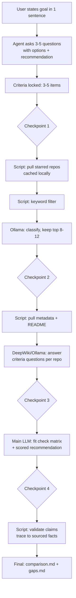

# Starsieve

Starsieve is an agent skill that helps you pick among GitHub repos you've already starred. Tell it what you need, it asks a few questions, then sifts your stars and compares the best candidates against your criteria — using facts, not vibes.

## Why

You star repos thinking "I'll use this someday." Then you need to pick one and face 2000+ stars with no system to compare them. Reading every README costs time and tokens. Starsieve fixes this: scripts pull data, a cheap model filters noise, and your main LLM only sees pre-digested facts for 8-12 candidates.

## Tool availability

| Tool | Required | Role | If missing |
|------|----------|------|------------|
| `gh` CLI | Yes | Pull stars, metadata, READMEs | Skill cannot run |
| Ollama | No | Classify candidates, summarize READMEs | Main LLM does it (more tokens) |
| DeepWiki | No | Deep architecture questions | Ollama/LLM reads README instead |
| Sideshow | No | Visual checkpoint cards | Checkpoints in plain chat |
| `jq` | No | JSON parsing in scripts | Falls back to Python |

Checked at startup. The skill tells you exactly what path it takes.

## Pipeline



## How it works — your perspective

1. **Say what you need.** One sentence: "I need a state management library for React."
2. **Answer 3-5 questions.** One at a time, each with options and a recommendation. This locks criteria, priorities, and constraints.
3. **Approve candidates.** 8-12 relevant repos with a one-line reason each. Remove, add, or expand.
4. **Review facts.** Compact fact cards per repo, plus any gaps where data was missing.
5. **Get a comparison.** Fit check matrix (✅/❌ per criterion), weighted scores, ranked recommendation. Every claim links to a source.
6. **Validation.** Script checks every ✅ traces to a real fact — no unsourced claims survive.

## Token economy

Scripts (free) pull data. Ollama (cheap) filters and summarizes. Main LLM only reads pre-digested facts. Your main model never sees a raw README or irrelevant repo.

## Install

```bash
ln -s ~/repos/starsieve ~/.pi/agent/skills/starsieve
```

Requires `gh auth login`. Optional: Ollama, DeepWiki MCP, Sideshow.