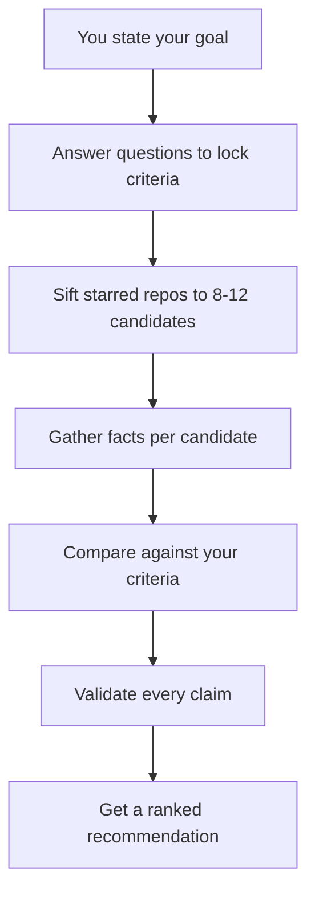
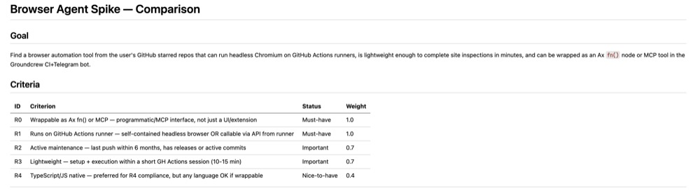
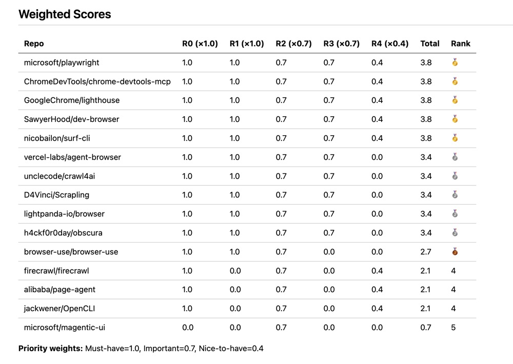
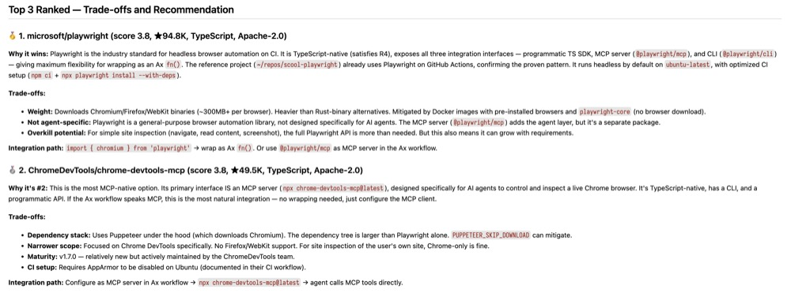

# Starlord

Starlord helps you pick among GitHub repos you've already starred. Tell it what you need, answer a few questions, and it sifts your stars down to the best candidates. Facts, not vibes.

## Design decisions

- **Scripts do the grunt work.** Pulling stars, fetching metadata, filtering by keywords. All free, no tokens. The main LLM only sees pre-digested facts for 8-12 candidates, never a raw README.
- **Every claim traces to a source.** A validation script checks that each ✅ in the matrix references a real fact file. No unsourced claims survive.
- **Interactive grilling, not templates.** Criteria come from your actual goal through questions. No preset checklists. You lock 3-5 criteria with priorities and constraints before any repo is evaluated.
- **Works with whatever tools you have.** `gh` CLI is required. Ollama, DeepWiki, and Sideshow are optional. The skill tells you exactly what path it takes when something is missing.

## Who it's for

You have dozens or hundreds of starred repos and no system to compare them when you actually need to pick one.

Good for:
- Choosing a state management library, testing framework, or UI component kit
- Comparing two similar tools you starred months ago and forgot why
- Narrowing a broad category like "a Go web framework" to 3-5 real candidates

## Tool availability

| Tool | Required | Role | If missing |
|------|----------|------|------------|
| `gh` CLI | Yes | Pull stars, metadata, READMEs | Skill cannot run |
| Ollama | No | Classify, summarize | Main LLM does it |
| DeepWiki | No | Architecture questions | Ollama/LLM reads README |
| Sideshow | No | Visual checkpoints | Plain chat |
| `jq` | No | JSON parsing | Falls back to Python |

## Pipeline



## How it works

1. Say what you need. One sentence.
2. Answer 3-5 questions, each with options and a recommendation. This locks your criteria, priorities, and constraints.
3. Approve 8-12 candidates, each with a one-line reason.
4. Review fact cards per repo and any gaps.
5. Get a fit check matrix, weighted scores, and a ranked recommendation. Every claim links to a source.
6. A script validates that every ✅ in the matrix traces to a real fact.

## Examples

From a real run: comparing browser automation tools for a CI pipeline.

<details>
<summary>Locked criteria (goal + weighted requirements)</summary>



</details>

<details>
<summary>Weighted scores (all candidates scored against criteria)</summary>



</details>

<details>
<summary>Recommendation (top 3 with trade-offs and integration path)</summary>



</details>

## Token economy

Scripts pull data for free. Ollama filters and summarizes cheaply. Your main LLM only sees pre-digested facts, never a raw README.

## Quick start

1. Install and authenticate:
```bash
ln -s ~/repos/starlord ~/.pi/agent/skills/starlord
gh auth login
```

2. Tell the agent what you need:

   > I need a state management library for React

Starlord asks a few questions, sifts your stars, and hands you a validated comparison.

## Sample output

Each run creates a task folder with the full comparison and its evidence:

```
.starlord/react-state-management/
├── goal.md               your goal + locked criteria
├── candidates-raw.json   all stars (pre-filter)
├── candidates.json       filtered 8-12 candidates
├── meta/
│   ├── reduxjs_redux_meta.json
│   ├── reduxjs_redux_readme.md
│   └── ...
├── facts/
│   ├── zustand_facts.json
│   └── ...
├── comparison.md         fit check matrix + scores + recommendation
├── gaps.md               known unknowns, missing data
├── validation.txt        validation script output
└── run.log               execution log
```

The deliverable is `comparison.md`. Everything else is traceable evidence behind it.